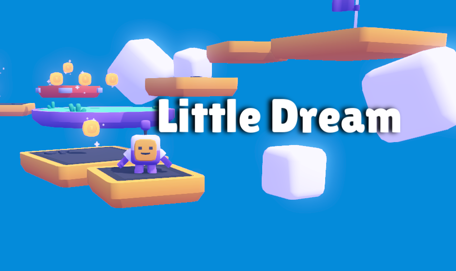

# 🌌 Little Dream - Team Chocoplay



**Little Dream** é uma experiência interativa em 3D feita com a engine **Godot**, que combina estética minimalista, mecânicas simples e uma narrativa poética. Seu objetivo não é vencer inimigos ou acumular pontos — é **refletir sobre a vida**, suas jornadas e a beleza dos momentos passageiros.

---

## ✨ Destaques Técnicos

O jogo cumpre os **requisitos obrigatórios de um projeto 3D**, com qualidade visual e estrutural:

### 🎥 Sistema de Câmera
- `Camera3D` configurada corretamente
- Seguimento suave do personagem
- Controles de visualização intuitivos

### 💡 Iluminação
- Luz direcional como fonte principal
- Fontes de luz complementares
- Sombras configuradas para realismo e atmosfera

### 🎨 Materiais e Texturas
- Uso de `StandardMaterial3D`
- Múltiplas texturas aplicadas
- Implementação de `Normal Maps` para detalhes

### 🧍 Animações do Personagem
- Personagem principal animado
- Transições suaves entre estados (idle, movimento, interação)
- Sincronização com os inputs do jogador

---

## 📖 Narrativa e Propósito

> “Essa talvez tenha sido uma aventura curta... mas assim é a vida.”

**Little Dream** é uma metáfora jogável. Ele convida o jogador a:
- Refletir sobre o valor do tempo
- Observar a leveza das pequenas ações
- Encontrar beleza nas breves jornadas

### 💬 Mensagem Final do Jogo
> Parabéns, jogador!  
> Essa talvez tenha sido uma aventura curta... mas assim é a vida.  
> Espero que tire boas reflexões dessa jornada e aproveite cada segundo daqui pra frente.  
> Viva sua vida da melhor forma que puder.  
> Nos vemos por aí.  
> Fique de olho no céu.

---

## 🎮 Como Jogar

1. Clone este repositório:
   ```bash
   git clone https://github.com/newtsarthur/godot-little-dream.git

2. Abra o projeto com o **Godot Engine 4.2+**

3. Execute a cena principal

4. Controles:

   * `WASD` → Movimentar personagem
   * `Setas` → Controlar a câmera
   * `Space` → Pular

---

## 👥 Equipe de Desenvolvimento

* **Arthur Belo - 01615335**
* **Bruno Lourenço - 01606518**
* **Victor Gouveia - 01602538**
* **Jean Ricardo - 01583760**

## 🔍 Equipe de pesquisa
* **Paulo Vinícius Feliciano de Souza - 01618133**
* **Lucas Araújo Da Silva -01589449**
* **Lucas Maia Sivini - 01616874**

---

## 📜 Licença

Este projeto está licenciado sob a [MIT License](LICENSE).
Sinta-se livre para estudar, adaptar e compartilhar – mantendo os devidos créditos.

---

> “Uma breve jornada pode deixar marcas eternas.”
> — Equipe Chocoplay
